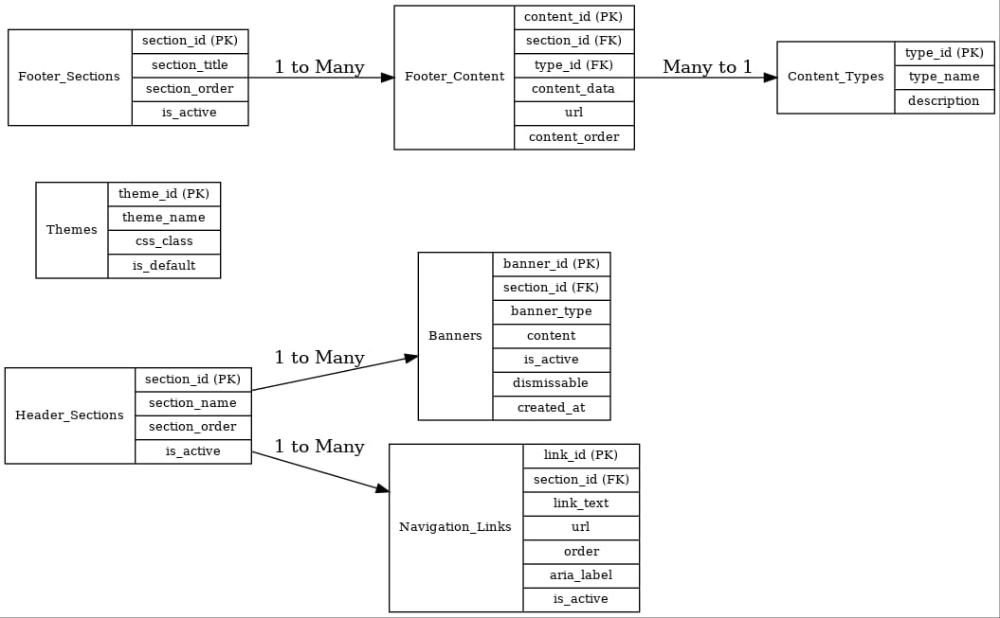

### *Database Design Documentation for Header and Footer Sections*

This document outlines the database design for managing the Header and Footer sections of a web application. 
The design ensures scalability, flexibility, and compliance with best practices.

### *1. System Overview*

The database is designed to support dynamic content management for the Header and Footer sections. 
This allows administrators to update navigation links, banners, themes, and footer content without modifying the application's codebase.

### *2. Database Objectives*

1. Provide a structured and normalized schema.
2. Support dynamic updates for banners, navigation links, themes, and footer sections.
3. Ensure scalability for additional features in the future.
4. Maintain data integrity and security.

### *3. Database Schema*

#### *Header Section Schema*

##### *1. Header Sections Table*

*Purpose:* To store and manage different header sections such as banners, navigation links, and other elements.

*Table Name:* header_sections

*Columns:*

| Column       | Type         | Constraints        | Description                                        |
|--------------|--------------|--------------------|----------------------------------------------------|
| section_id   | INT (PK)     | Auto Increment     | Unique identifier for the section.                 |
| section_name | VARCHAR(100) | NOT NULL           | Name of the header section (e.g., "Banner", "Navbar"). |
| section_order| INT          | NOT NULL           | Order in which the section appears in the header.  |
| is_active    | BOOLEAN      | DEFAULT TRUE       | Indicates if the section is currently active.      |

##### *2. Banners Table*

*Purpose:* To manage banners (temporary and permanent) that are part of the header section.

*Table Name:* banners

*Columns:*

| Column       | Type         | Constraints        | Description                                      |
|--------------|--------------|--------------------|--------------------------------------------------|
| banner_id    | INT (PK)     | Auto Increment     | Unique identifier for the banner.                |
| section_id   | INT (FK)     | NOT NULL REFERENCES header_sections(section_id) | References the header section. |
| banner_type  | ENUM         | 'temporary', 'permanent' | Type of the banner.                              |
| content      | TEXT         | NOT NULL           | Content of the banner.                           |
| is_active    | BOOLEAN      | DEFAULT TRUE       | Indicates whether the banner is currently active.|
| dismissable  | BOOLEAN      | DEFAULT FALSE      | Indicates if the banner can be dismissed.        |
| created_at   | TIMESTAMP    | DEFAULT CURRENT_TIMESTAMP | Timestamp of creation.                   |

##### *3. Navigation Links Table*

*Purpose:* To store the links in the header's navigation menu, which can be updated and reordered.

*Table Name:* navigation_links

*Columns:*

| Column       | Type         | Constraints        | Description                                      |
|--------------|--------------|--------------------|--------------------------------------------------|
| link_id      | INT (PK)     | Auto Increment     | Unique identifier for each navigation link.      |
| section_id   | INT (FK)     | NOT NULL REFERENCES header_sections(section_id) | References the header section. |
| link_text    | VARCHAR(100) | NOT NULL           | Text displayed on the link.                      |
| url          | TEXT         | NOT NULL           | URL the link points to.                          |
| order        | INT          | NOT NULL           | Display order of the link within the section.    |
| aria_label   | VARCHAR(100) | NULL               | Accessibility label for the link.                |
| is_active    | BOOLEAN      | DEFAULT TRUE       | Indicates if the link is active.                 |

##### *4. Themes Table*

*Purpose:* To manage the theme options for the header section (e.g., light, dark, custom themes).

*Table Name:* themes

*Columns:*

| Column       | Type         | Constraints        | Description                                      |
|--------------|--------------|--------------------|--------------------------------------------------|
| theme_id     | INT (PK)     | Auto Increment     | Unique identifier for the theme.                 |
| theme_name   | VARCHAR(50)  | NOT NULL           | Name of the theme.                               |
| css_class    | VARCHAR(50)  | NOT NULL           | Associated CSS class for the theme.              |
| is_default   | BOOLEAN      | DEFAULT FALSE      | Indicates if this is the default theme.          |

#### *Footer Section Schema*

##### *1. Footer Sections Table*

*Purpose:* To manage sections in the footer (e.g., "Contact Us", "Quick Links", "Follow Us").

*Table Name:* footer_sections

*Columns:*

| Column       | Type         | Constraints        | Description                                      |
|--------------|--------------|--------------------|--------------------------------------------------|
| section_id   | INT (PK)     | Auto Increment     | Unique identifier for each section in the footer.|
| section_title| VARCHAR(100) | NOT NULL           | Title of the section.                            |
| section_order| INT          | NOT NULL           | Order in which the section appears in the footer.|
| is_active    | BOOLEAN      | DEFAULT TRUE       | Indicates whether the section is active.         |

##### *2. Footer Content Table*

*Purpose:* To store content for the footer sections, including text, links, and other media.

*Table Name:* footer_content

*Columns:*

| Column       | Type         | Constraints        | Description                                      |
|--------------|--------------|--------------------|--------------------------------------------------|
| content_id   | INT (PK)     | Auto Increment     | Unique identifier for the content item.          |
| section_id   | INT (FK)     | NOT NULL REFERENCES footer_sections(section_id) | References the footer section. |
| type_id      | INT (FK)     | NOT NULL REFERENCES content_types(type_id) | Defines the type of content. |
| content_data | TEXT         | NOT NULL           | The actual content.                              |
| url          | TEXT         | NULL               | URL for link content.                            |
| content_order| INT          | NOT NULL           | Display order within the section.                |

##### *3. Content Types Table*

*Purpose:* To define the types of content that can be placed in the footer (e.g., text, link, icon).

*Table Name:* content_types

*Columns:*

| Column       | Type         | Constraints        | Description                                      |
|--------------|--------------|--------------------|--------------------------------------------------|
| type_id      | INT (PK)     | Auto Increment     | Unique identifier for the content type.          |
| type_name    | VARCHAR(50)  | NOT NULL           | Name of the content type.                        |
| description  | TEXT         | NULL               | Description of the content type.                 |

### *4. Entity-Relationship Diagram (ERD)*

1. *header_sections:*
    - Manages sections like banners, navbar, and theme options.
    - Can link to multiple banners and navigation_links.

2. *banners:*
    - Each banner is linked to a header_section and can be either temporary or permanent.

3. *navigation_links:*
    - Each navigation link is associated with a header_section.

4. *footer_sections:*
    - Footer sections can contain multiple content items (e.g., text, links, icons).

5. *footer_content:*
    - Content items in the footer are linked to footer_sections and defined by content_types.

### *5. Example Data*

#### *Header Sections*

| section_id | section_name       | section_order | is_active |
|------------|--------------------|---------------|-----------|
| 1          | Main Navigation    | 1             | TRUE      |
| 2          | Promotions         | 2             | TRUE      |

#### *Banners*

| banner_id | section_id | banner_type | content          | is_active | dismissable | created_at             |
|-----------|------------|-------------|------------------|-----------|-------------|------------------------|
| 1         | 2          | permanent   | "Welcome Offer!" | TRUE      | FALSE       | 2024-12-09 00:48:00    |

#### *Navigation Links*

| link_id | section_id | link_text  | url            | order | aria_label | is_active |
|---------|------------|------------|----------------|-------|------------|-----------|
| 1       | 1          | Home       | /home          | 1     | Home link  | TRUE      |
| 2       | 1          | About Us   | /about         | 2     | About link | TRUE      |

#### *Themes*

| theme_id | theme_name   | css_class   | is_default |
|----------|--------------|-------------|------------|
| 1        | Light Theme  | light-theme | TRUE       |
| 2        | Dark Theme   | dark-theme  | FALSE      |

#### *Footer Sections*

| section_id | section_title | section_order | is_active |
|------------|---------------|---------------|-----------|
| 1          | Contact Us    | 1             | TRUE      |
| 2          | Quick Links   | 2             | TRUE      |

#### *Footer Content*

| content_id | section_id | type_id | content_data      | url              | content_order |
|------------|------------|---------|-------------------|------------------|---------------|
| 1          | 1          | 1       | "123 Main St."    | NULL             | 1             |
| 2          | 2          | 2       | "Privacy Policy"  | /privacy-policy  | 1             |

### Entity-Relationship Diagram (ERD) for the database design:

Header Sections

- Header_Sections (Entity)
    - section_id (Primary Key, Integer)
    - section_name (String)
    - section_order (Integer)
    - is_active (Boolean)

Banners

- Banners (Entity)
    - banner_id (Primary Key, Integer)
    - section_id (Foreign Key, Integer) referencing Header_Sections
    - banner_type (String)
    - content (String)
    - is_active (Boolean)
    - dismissable (Boolean)
    - created_at (Timestamp)

Navigation Links

- Navigation_Links (Entity)
    - link_id (Primary Key, Integer)
    - section_id (Foreign Key, Integer) referencing Header_Sections
    - link_text (String)
    - url (String)
    - order (Integer)
    - aria_label (String)
    - is_active (Boolean)

Themes

- Themes (Entity)
    - theme_id (Primary Key, Integer)
    - theme_name (String)
    - css_class (String)
    - is_default (Boolean)

Footer Sections

- Footer_Sections (Entity)
    - section_id (Primary Key, Integer)
    - section_title (String)
    - section_order (Integer)
    - is_active (Boolean)

Footer Content

- Footer_Content (Entity)
    - content_id (Primary Key, Integer)
    - section_id (Foreign Key, Integer) referencing Footer_Sections
    - type_id (Foreign Key, Integer) referencing Content_Types
    - content_data (String)
    - url (String)
    - content_order (Integer)

Content Types

- Content_Types (Entity)
    - type_id (Primary Key, Integer)
    - type_name (String)
    - description (String)

Relationships:

- A Header_Sections can have multiple Banners (One-To-Many).
- A Header_Sections can have multiple Navigation_Links (One-To-Many).
- A Footer_Sections can have multiple Footer_Content (One-To-Many).
- A Footer_Content is associated with one Content_Types (Many-To-One).