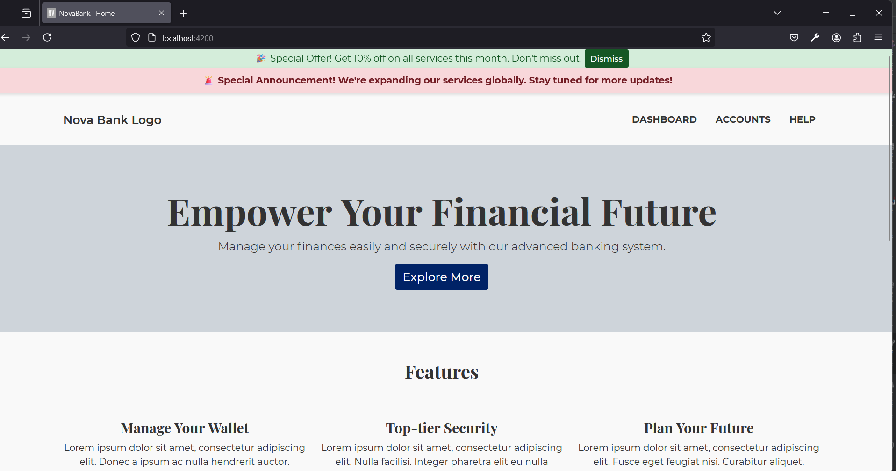
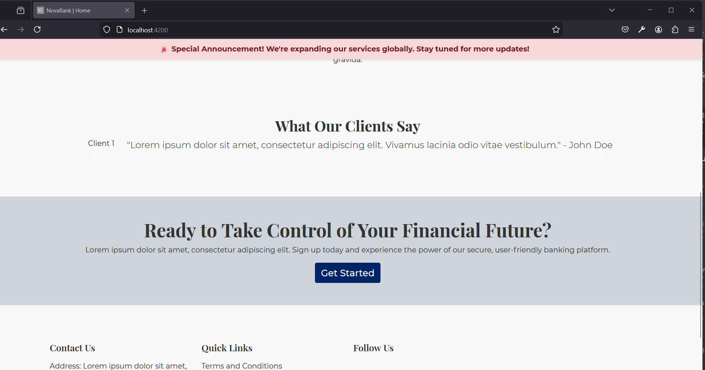
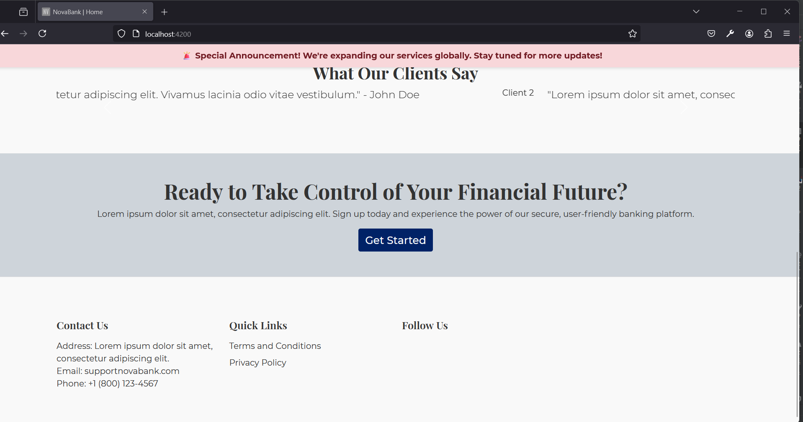

# NovaBank UI (Responsive Web)

## Overview

This project leverages **Angular** for the dynamic user interface and **Gulp** for theme management, asset optimization, and build automation. The goal is to provide a modular and scalable Angular application that uses **SCSS** for styling, integrates **Bootstrap** for UI components, and handles theme switching dynamically based on environment settings. Additionally, it optimizes assets for production by minifying JavaScript and CSS files.

## Key Objectives

- **Angular for the UI**: Angular is used to create a dynamic user interface that interacts with a backend via RESTful APIs.
  
- **Gulp for Theme Management**: Gulp manages the asset pipeline, compiles SCSS to CSS, minifies JavaScript, and dynamically handles theme switching based on environment settings.

- **Use of SCSS for Styling**: SCSS ensures modular and maintainable styles, making it easy to customize and scale the UI.

- **Bootstrap Integration**: The project uses Bootstrap for layout and UI components, ensuring a responsive design and speeding up development.

- **Environment-Driven Theme Management**: Gulp enables dynamic switching between light and dark modes based on environment settings, providing flexibility.

- **Optimized Assets for Production**: In production, assets like JavaScript and CSS are minified and optimized for faster loading and better performance.

## Implementation Breakdown

### Angular Project Setup

The Angular project is structured to support modular and scalable components, with SCSS used for styling. The build system utilizes `@angular-devkit/build-angular`, ensuring optimizations are enabled during production builds.

- **SCSS Configuration**: 
  - For development, SCSS files are located at `src/assets/scss/app.scss` and Bootstrap SCSS files at `node_modules/bootstrap/scss/bootstrap/bootstrap.scss`.
  - For production, Gulp takes care of additional optimizations, ensuring that the `app.min.css` file is generated with minified styles.

- **Gulp Tasks**: 
  Gulp automates several key tasks:
  - **Compile SCSS**: SCSS files are compiled into minified CSS for both light and dark themes.
  - **Concatenate and Minify JavaScript**: JavaScript files are minified into `app.min.js` for optimized loading and performance.
  - **Switch Themes**: Gulp dynamically switches between themes based on environment settings (e.g., `process.env.THEME`).
  - **Cache Clearing**: Gulp ensures the cache is cleared to reflect any new changes to assets.

- **Watching for Changes**: The `watchFiles` function monitors changes to SCSS, JavaScript, and HTML files, automatically triggering recompilation.

### Gulp File Configuration

- **Themes Compilation**: 
  Gulp compiles and minifies both default and dark themes to offer a smooth user experience between the two.

- **JavaScript Concatenation**: 
  The `app.min.js` file is compiled to include essential dependencies like Bootstrap JS, jQuery, and Popper.js, optimizing load time and performance.

## License

NovaBank UI is released under the **CLOSED-SOURCE License**. For detailed terms, please refer to the [LICENSE](LICENSE) file.

## Contact

For any questions, issues, or feedback, please contact the NovaBank Core team at:  
**ui@novabank.co.za**